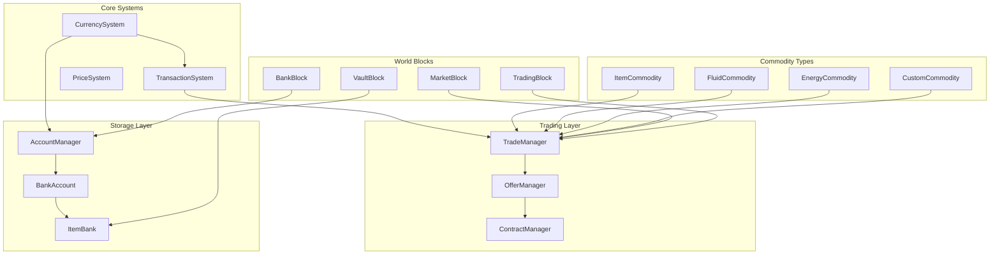

# Global Economy System Design

## Overview
A universal economy system supporting trade of items, fluids, energy, and custom commodities with a single global currency.

## Architecture



## 1. Core Currency System

### Currency Unit
- **Base Unit**: "Coin" (configurable display name)
- **Fractional**: Supports decimals (0.01 precision)
- **Universal**: Single currency across all dimensions

### Currency Storage
```java
// Server-side player balance storage - purely virtual
public interface IBankAccount {
    UUID getOwner();
    BigDecimal getBalance();
    
    // Direct operations - no physical items involved
    boolean credit(BigDecimal amount, TransactionContext ctx);
    boolean debit(BigDecimal amount, TransactionContext ctx);
    boolean transferTo(IBankAccount target, BigDecimal amount, TransactionContext ctx);
    
    // Transaction history
    List<TransactionRecord> getRecentTransactions(int count);
}

// Account manager handles all player accounts
public interface IAccountManager {
    IBankAccount getPlayerAccount(UUID player);
    IBankAccount getOrCreatePlayerAccount(UUID player);
    boolean hasAccount(UUID player);
    
    // Server accounts for system operations
    IBankAccount getServerAccount();
    IBankAccount getTaxAccount();
}
```

### Wallet System
- **Virtual Accounts Only**: All currency stored in secure server-side accounts
- **No Physical Items**: Currency exists only as account balances
- **Universal Access**: Players can access their funds from any Bank Block or command
- **Offline Support**: Transactions processed even when players are offline

## 2. Commodity Framework

### Commodity Interface
```java
public interface ICommodity {
    ResourceLocation getId();
    CommodityType getType(); // ITEM, FLUID, ENERGY, CUSTOM
    Component getDisplayName();
    
    // For trading
    boolean canExtractFrom(IStorage storage, int amount);
    boolean canInsertInto(IStorage storage, int amount);
    boolean extractFrom(IStorage storage, int amount);
    boolean insertInto(IStorage storage, int amount);
    
    // Pricing
    BigDecimal getBasePrice();
    boolean hasDynamicPricing();
}
```

### Commodity Types

#### Items
- Standard Minecraft items
- Support for NBT data matching (configurable strictness)
- Bulk trading support (stacks, shulkers)

#### Fluids
- Forge/NeoForge fluid tanks
- Fabric fluid storage
- Universal buckets as intermediary

#### Energy
- Forge Energy (FE) support
- Fabric Energy API support
- EU (IndustrialCraft) support via adapters

#### Custom Commodities
- API for other mods to register tradeable resources
- Examples: Thaumcraft essentia, Botania mana, XP

## 3. Trading System

### Offer System
```java
public interface IOffer {
    UUID getOfferId();
    UUID getOwner();
    
    // What the seller is selling
    ICommodity getCommodity();
    int getQuantity();
    
    // What the seller wants
    BigDecimal getPrice(); // Price per unit or total
    
    OfferType getType(); // SELL, BUY, BARTER
    
    // Execution
    boolean canExecute(ITrader buyer);
    TransactionResult execute(ITrader buyer);
}
```

### Market Types

#### Player Markets
- **Direct Trading**: Player-to-player instant trade
- **Shop Blocks**: Physical shops players place in world
- **Auction House**: Time-based bidding system
- **Global Market**: Server-wide listing board

#### Automated Markets
- **Villager Integration**: Trade with villagers using currency
- **Dungeon Loot**: Buy/sell with dungeon "merchants"
- **World Events**: Dynamic pricing during events

### Price Dynamics (Optional)
```java
public interface IPriceModel {
    BigDecimal getCurrentPrice(ICommodity commodity);
    void recordTransaction(ICommodity commodity, int quantity, BigDecimal price);
    
    // Supply/Demand tracking
    double getDemandFactor(ICommodity commodity);
    double getSupplyFactor(ICommodity commodity);
}
```

Price models:
- **Fixed**: Admin-set prices
- **Dynamic**: Supply/demand based
- **Hybrid**: Base price + fluctuation limits

## 3.1 Global Market Price Calculation

### Price Discovery Mechanisms

#### 1. Order Book Analysis (Primary Method)
The market price is derived from active buy and sell offers:

```java
public class OrderBookPriceCalculator {
    /**
     * Calculates market price based on order book depth
     * Uses Volume Weighted Average Price (VWAP) of best bids/asks
     */
    public BigDecimal calculateMarketPrice(ICommodity commodity) {
        List<IOffer> buyOffers = getActiveBuyOffers(commodity);  // Sorted highest first
        List<IOffer> sellOffers = getActiveSellOffers(commodity); // Sorted lowest first
        
        if (buyOffers.isEmpty() && sellOffers.isEmpty()) {
            return commodity.getBasePrice(); // Fallback to base price
        }
        
        // Find the spread
        BigDecimal bestBid = buyOffers.isEmpty() ? BigDecimal.ZERO : buyOffers.get(0).getPrice();
        BigDecimal bestAsk = sellOffers.isEmpty() ? BigDecimal.valueOf(Double.MAX_VALUE) : sellOffers.get(0).getPrice();
        
        // Calculate mid-price when there's overlap or gap
        if (bestBid.compareTo(bestAsk) >= 0) {
            // Market has overlapping orders - use last trade price or mid
            return getLastTradePrice(commodity)
                .orElse(bestBid.add(bestAsk).divide(BigDecimal.valueOf(2), 2, RoundingMode.HALF_UP));
        }
        
        // Calculate VWAP of top N offers on each side
        BigDecimal bidVWAP = calculateVWAP(buyOffers.subList(0, Math.min(5, buyOffers.size())));
        BigDecimal askVWAP = calculateVWAP(sellOffers.subList(0, Math.min(5, sellOffers.size())));
        
        // Market price is midpoint between bid/ask VWAP
        return bidVWAP.add(askVWAP).divide(BigDecimal.valueOf(2), 2, RoundingMode.HALF_UP);
    }
}
```

#### 2. Trade History Weighting
Recent trades have more influence on current price:

```java
public class TradeHistoryPriceCalculator {
    /**
     * Exponential Moving Average of recent trade prices
     * Gives more weight to recent transactions
     */
    public BigDecimal calculateEMAPrice(ICommodity commodity, int periods) {
        List<TradeRecord> recentTrades = getRecentTrades(commodity, periods);
        
        if (recentTrades.isEmpty()) {
            return commodity.getBasePrice();
        }
        
        double multiplier = 2.0 / (periods + 1);
        BigDecimal ema = recentTrades.get(0).getPrice();
        
        for (int i = 1; i < recentTrades.size(); i++) {
            BigDecimal price = recentTrades.get(i).getPrice();
            ema = price.multiply(BigDecimal.valueOf(multiplier))
                      .add(ema.multiply(BigDecimal.valueOf(1 - multiplier)));
        }
        
        return ema;
    }
}
```

#### 3. Supply/Demand Index (SDI)
Measures market pressure based on order book imbalance:

```java
public class SupplyDemandIndex {
    /**
     * SDI ranges from -100 (extreme oversupply) to +100 (extreme demand)
     * 0 indicates balanced market
     */
    public double calculateSDI(ICommodity commodity) {
        double totalBuyVolume = getTotalBuyVolume(commodity);
        double totalSellVolume = getTotalSellVolume(commodity);
        double totalVolume = totalBuyVolume + totalSellVolume;
        
        if (totalVolume == 0) return 0;
        
        // Normalize to -100 to +100 range
        return ((totalBuyVolume - totalSellVolume) / totalVolume) * 100;
    }
    
    /**
     * Adjusts base price based on SDI
     * High demand (+SDI) increases price, high supply (-SDI) decreases price
     */
    public BigDecimal adjustPriceBySDI(BigDecimal basePrice, double sdi, double maxFluctuation) {
        // sdi is -100 to +100, normalize to -1 to +1
        double factor = sdi / 100.0;
        
        // Apply non-linear curve for more realistic price movement
        double adjustment = Math.signum(factor) * Math.pow(Math.abs(factor), 1.5);
        
        // Cap at max fluctuation percentage
        double cappedAdjustment = Math.max(-maxFluctuation, Math.min(maxFluctuation, adjustment));
        
        return basePrice.multiply(BigDecimal.valueOf(1 + cappedAdjustment));
    }
}
```

#### 4. Composite Price Algorithm
Combines multiple factors for final market price:

```java
public class CompositePriceCalculator {
    
    public MarketPrice calculatePrice(ICommodity commodity) {
        // 1. Base price from commodity definition or admin config
        BigDecimal basePrice = commodity.getBasePrice();
        
        // 2. Order book price (30% weight) - current market sentiment
        BigDecimal orderBookPrice = orderBookCalculator.calculate(commodity);
        
        // 3. Trade history EMA (40% weight) - what people actually paid
        BigDecimal emaPrice = tradeHistoryCalculator.calculateEMA(commodity, 20);
        
        // 4. Supply/Demand adjustment (20% weight) - market pressure
        double sdi = sdiCalculator.calculate(commodity);
        BigDecimal sdiAdjustedPrice = sdiCalculator.adjustPriceBySDI(basePrice, sdi, 0.5);
        
        // 5. Volatility adjustment (10% weight) - market stability
        BigDecimal volatilityFactor = calculateVolatilityAdjustment(commodity);
        
        // Weighted composite
        BigDecimal composite = orderBookPrice.multiply(BigDecimal.valueOf(0.30))
            .add(emaPrice.multiply(BigDecimal.valueOf(0.40)))
            .add(sdiAdjustedPrice.multiply(BigDecimal.valueOf(0.20)))
            .add(basePrice.multiply(volatilityFactor).multiply(BigDecimal.valueOf(0.10)));
        
        return new MarketPrice(
            composite,
            calculateConfidence(commodity), // How reliable is this price?
            sdi, // Market pressure indicator
            getPriceTrend(commodity) // Rising, falling, stable
        );
    }
}
```

### Special Cases

#### Low Liquidity Handling
When few or no orders exist:
- Use **base price** with confidence marker "LOW_LIQUIDITY"
- Widen the bid-ask spread indicator
- Flag for admin review if no trades in 24 hours

```java
if (getActiveOfferCount(commodity) < 3) {
    return MarketPrice.builder()
        .price(commodity.getBasePrice())
        .confidence(PriceConfidence.LOW_LIQUIDITY)
        .spread(BigDecimal.valueOf(0.20)) // 20% spread
        .build();
}
```

#### Price Floor/Ceiling
Configurable limits to prevent extreme volatility:

```java
public BigDecimal applyPriceLimits(BigDecimal calculatedPrice, BigDecimal basePrice) {
    double maxChange = config.getMaxPriceChangePercent() / 100.0; // e.g., 50%
    
    BigDecimal minPrice = basePrice.multiply(BigDecimal.valueOf(1 - maxChange));
    BigDecimal maxPrice = basePrice.multiply(BigDecimal.valueOf(1 + maxChange));
    
    if (calculatedPrice.compareTo(minPrice) < 0) return minPrice;
    if (calculatedPrice.compareTo(maxPrice) > 0) return maxPrice;
    return calculatedPrice;
}
```

### Price Update Frequency
- **Active commodities** (many trades): Every 5 minutes
- **Normal commodities**: Every 15 minutes  
- **Inactive commodities**: Every hour
- **Immediate update** on any trade execution

### Displayed Price Information
When players view a commodity in the market:
- **Current Market Price**: The composite calculated price
- **Bid/Ask Spread**: Best buy vs best sell offer
- **24h Volume**: Number of units traded
- **24h Change**: Percentage price change
- **Confidence**: High/Medium/Low liquidity indicator
- **Trend Arrow**: ↗ Rising, ↘ Falling, → Stable

## 4. Transaction System

### Transaction Safety
```java
public class Transaction {
    private final UUID transactionId;
    private final TransactionType type;
    private final List<TransactionStep> steps;
    
    public TransactionResult commit() {
        // Two-phase commit
        // 1. Validate all steps can execute
        // 2. Execute all steps
        // 3. Rollback on failure
    }
}
```

### Transaction Types
- **Instant**: Direct player trade
- **Queued**: Offline trading (delivered when player returns)
- **Contract**: Future delivery agreements
- **Recurring**: Subscription-based trades

## 5. Storage Blocks

### Market Block
- Interface for browsing offers
- Create new sell/buy orders
- View price history charts

### Trading Block (Terminal)
- Quick buy/sell at market price
- Bulk trading interface
- Favorites/bookmarks

### Bank Block
- Access virtual wallet
- Transfer funds
- View transaction history
- Set up recurring payments

### Vault Block
- Secure item storage for trading
- Linked to offers (items held in escrow)
- Upgradeable storage tiers

## 6. Network Architecture

### Server-Side (Authority)
- All balances stored server-side
- Transaction validation
- Offer matching engine
- Price history recording

### Client-Side
- Cached balance display
- Offer browsing (synced from server)
- UI rendering only

### Synchronization
```java
// Key network packets
- BalanceUpdatePacket (to client)
- OfferSyncPacket (bidirectional)
- TransactionRequestPacket (client to server)
- TransactionResultPacket (server to client)
- MarketDataPacket (periodic sync)
```

## 7. API for Mod Integration

### Registering Custom Commodities
```java
public interface IEconomyAPI {
    // Currency
    IBankAccount getOrCreateAccount(UUID player);
    
    // Commodities
    void registerCommodity(ICommodity commodity);
    ICommodity getCommodity(ResourceLocation id);
    
    // Trading
    void registerMarket(IMarket market);
    IOffer createOffer(OfferBuilder builder);
    
    // Events
    void registerTransactionListener(ITransactionListener listener);
}
```

### Event Hooks
- `TransactionEvent.Pre/Post`
- `PriceChangeEvent`
- `OfferCreateEvent`
- `OfferExecuteEvent`

## 8. Configuration

### Server Config
```toml
[currency]
    name = "Coin"
    symbol = "¤"
    starting_balance = 100.0
    
[trading]
    tax_rate = 0.05
    min_price = 0.01
    max_price = 1000000
    enable_dynamic_pricing = true
    
[storage]
    max_bank_accounts_per_player = 3
    vault_base_capacity = 54
    vault_upgrade_multiplier = 2
```

## 9. Commands

- `/balance [player]` - Check balance
- `/pay <player> <amount>` - Transfer currency
- `/market` - Open market UI
- `/sell <amount> <commodity> <price>` - Quick sell command
- `/buy <amount> <commodity> [max_price]` - Quick buy command
- `/economy admin give|take|set <player> <amount>` - Admin commands

## Implementation Phases

### Phase 1: Core
- Currency system
- Basic bank accounts
- Item trading only

### Phase 2: Trading
- Offer system
- Market blocks
- Price history

### Phase 3: Expansion
- Fluid/energy support
- Custom commodity API
- Dynamic pricing

### Phase 4: Polish
- Advanced UIs
- Quest integration
- Analytics dashboard
