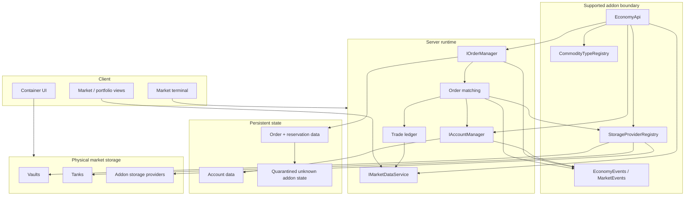

# Economy System Design

> **Status:** current architecture reference for Economy 0.0.11. Earlier versions of this file described aspirational `IOffer`, `IEconomyAPI`, Bank/Trading blocks, direct-storage commodity hooks, and standalone price-model systems that are not the implemented public architecture. For addon contracts, the authoritative references are [`docs/API_REFERENCE.md`](../docs/API_REFERENCE.md), [`docs/GETTING_STARTED.md`](../docs/GETTING_STARTED.md), and [`docs/EXTENDING_ECONOMY.md`](../docs/EXTENDING_ECONOMY.md).

## Goals

Economy provides one server-authoritative order-book market with virtual currency accounts, physical item/fluid storage, durable escrow, immutable market reads, and a stable addon boundary across supported Minecraft/loader targets.

The design prioritizes:

- no currency or commodity duplication/loss on failed transactions;
- server authority for balances, orders, storage, and matching;
- exact preservation of item/component/NBT state in escrow;
- loader-neutral addon contracts where Minecraft itself allows it;
- explicit lifecycle and persistence behavior;
- version-specific adapters kept behind shared services;
- real-game validation in addition to JVM tests.

## Supported runtime targets

| Minecraft | Loader | Runtime Java |
|---|---|---:|
| 1.20.1 | Fabric | 17 |
| 1.20.1 | Forge | 17 |
| 1.21.1 | Fabric | 21 |
| 1.21.1 | NeoForge | 21 |
| 26.1.2 | NeoForge | 25 |

A compiled addon or Economy jar must target the matching Minecraft generation and loader.

## Architecture


```mermaid
graph TB
    subgraph Addons[Supported addon boundary]
        EA[EconomyApi]
        EV[EconomyEvents / MarketEvents]
        CT[CommodityTypeRegistry]
        SP[StorageProviderRegistry]
    end

    subgraph Runtime[Server runtime]
        AM[IAccountManager]
        OM[IOrderManager]
        MD[IMarketDataService]
        MATCH[Order matching]
        LEDGER[Trade ledger]
    end

    subgraph Persistence[Persistent state]
        ACC[Account data]
        ORD[Order + reservation data]
        QUAR[Quarantined unknown addon state]
    end

    subgraph Storage[Physical market storage]
        VAULT[Vaults]
        TANK[Tanks]
        ADDON[Addon storage providers]
    end

    subgraph Client[Client]
        TERM[Market terminal]
        CONTAINERS[Container UI]
        CHARTS[Market / portfolio views]
    end

    EA --> AM
    EA --> OM
    EA --> MD
    EA --> CT
    EA --> SP
    OM --> MATCH
    MATCH --> AM
    MATCH --> SP
    MATCH --> LEDGER
    AM --> ACC
    OM --> ORD
    ORD --> QUAR
    SP --> VAULT
    SP --> TANK
    SP --> ADDON
    LEDGER --> MD
    AM --> EV
    OM --> EV
    MATCH --> EV
    TERM --> Runtime
    CONTAINERS --> Storage
    CHARTS --> MD
```

## 1. Public API boundary

The supported addon surface is the **top-level** `com.nstut.economy.api` package.

`com.nstut.economy.api.internal` and implementation packages such as `core`, `trading`, `data`, blocks, menus, packets, and loader adapters are not compatibility contracts even when Java visibility makes them reachable.

`EconomyApi` is the stable entry point for active runtime services:

```java
if (EconomyApi.isReady()) {
    IAccountManager accounts = EconomyApi.accounts();
    IOrderManager orders = EconomyApi.orders();
    IMarketDataService market = EconomyApi.marketData();
}
```

`accounts()`, `orders()`, `marketData()`, and `serverLevel()` are bound only while a server runtime is active and must not be cached across restarts.

`commodityTypes()` and `storage()` are process-level extension registries and survive server restarts. Addons register handlers/providers once during common initialization.

## 2. Currency and accounts

Currency is virtual and server-owned. `IBankAccount` exposes balance reads, credit/debit, atomic transfer, and transaction history. `IAccountManager` owns player, server, and tax accounts.

Money movement should carry an `ITransactionContext` with a namespaced `EconomyId` cause and optional immutable metadata. The legacy transaction enum remains only for compatibility projection.

### Atomic transfer invariant

A transfer must behave as one logical operation:

```text
failed/rejected transfer => source unchanged && target unchanged
successful transfer      => source -= amount && target += amount
```

A target rejection or exception must never leave the source debited.

## 3. Events

`EconomyEvents` is a synchronous, loader-neutral exact-class event bus. Listeners registered for one event class receive that class only; base-interface registration is not polymorphic subscription.

Cancellable pre-events include:

- `EconomyEvents.BalanceChangePre`
- `EconomyEvents.TransferPre`
- `MarketEvents.OrderCreatePre`

Committed-state events include balance/transfer completion, order creation/edit/cancel, trades, and storage-provider registration changes.

Pre-event cancellation happens before new provider escrow is created. Post-events are observations, not rollback hooks. Event handlers execute inline and must stay fast.

## 4. Commodity model

A commodity is identified by both its type and product ID:

```text
CommodityKey = (commodityTypeId, commodityId)
```

This full identity is required for analytics and persistence because two addon commodity types may intentionally expose the same product ID.

`EconomyId` is used by the public API instead of exposing Minecraft's changing identifier class names.

### Built-in and addon types

The API defines item, fluid, and energy type IDs plus `CUSTOM` as a broad legacy category. The implemented player-facing storage/trading path currently centers on items and fluids; an API type ID does not by itself imply a complete built-in storage/UI implementation for that resource.

Addon commodity behavior/persistence is registered through `ICommodityTypeHandler`. Each handler owns a versioned `CommodityPayload` codec and must continue decoding old schema versions while released saves may contain them.

The nested `ICommodity.IStorage` hooks are legacy compatibility APIs. New storage integrations use `IStorageProvider`.

## 5. Orders and matching

`IOrderManager` is the supported mutation/query surface. Addons should not construct or mutate internal order implementations directly.

Player creation returns `OrderCreateResult` with one of:

- `POSTED`
- `PARTIALLY_FILLED`
- `FILLED`
- `REJECTED`

An accepted fully filled order has no remaining book order. Server-order compatibility methods return `IOrder` on success and may return `null` when domain validation rejects creation.

Order edits/cancellation must go through the manager so authorization, persistence, money, escrow, and events remain centralized.

### Order-book authority

Matching occurs server-side. A completed trade updates money, delivery/escrow state, order quantities, trade history, and events as one coordinated flow. Client UI is never the authority for a trade.

## 6. Storage-provider model

`IStorageProvider` is the extension boundary for owner-scoped market inventory.

Providers expose:

- support and priority;
- side-effect-free `available` and `receivable` probes;
- atomic reservation creation;
- atomic delivery with the exact remaining reservation;
- all-or-nothing release.

### Single-provider reservation rule

One reservation belongs to exactly one provider.

`StorageProviderRegistry.available(...)` therefore reports the largest amount atomically available from **one** supporting provider, not the sum across providers. `reserve(...)` walks providers in priority order until one can reserve the full amount.

Receiving capacity differs: `receivable(...)` may aggregate capacity across providers up to the requested amount.

Once escrow exists, delivery/release routes strictly to `reservation.providerId()`. Economy does not reassign opaque escrow to another backend if that provider disappears.

## 7. Escrow and delivery invariants

A successful sell reservation transfers ownership of the reserved goods from ordinary storage into durable provider-owned escrow.

Across reservation, partial delivery, cancellation, restart, and provider outage:

```text
initial goods = delivered + still escrowed + successfully released
```

### Reservation

`reserve(...)` must be atomic:

```text
success => exact requested amount is durably escrowed
failure => no mutation
```

### Delivery

`deliverReserved(...)` returns both the amount actually delivered and the provider-owned exact remainder.

Economy validates:

```text
delivered + remaining.amount = before.amount
```

It also rejects delivery beyond the requested amount and rejects remaining reservations that change provider or commodity identity.

For items, the remainder must preserve the exact rejected/untouched stacks including components/NBT. Reconstructing generic stacks from a numeric count is not valid.

### Release

`release(...) == true` means every remaining unit was restored exactly once.

`release(...) == false` means the whole input reservation is still escrow. A provider must not partially restore goods and then return false. Providers must simulate first or use an internal rollback/transaction mechanism.

## 8. Built-in physical storage

### Vault

Vaults provide item storage connected to an owner and support market modes:

- `BOTH`: supply and receive;
- `INPUT`: supply market sells only;
- `OUTPUT`: receive purchases only.

The built-in storage provider preserves exact extracted item stacks in structured provider state.

### Tank

Tanks provide single-fluid storage up to `128,000 mB` and expose loader-compatible fluid automation. They use the same market mode model as Vaults.

Direct player/automation interaction is separate from whether a container is eligible to supply/receive through the market.

## 9. Persistence and missing addons

Order persistence stores commodity type identity, versioned codec payloads, provider reservations, metadata, and structured provider-owned NBT state.

Unknown/corrupt/unavailable addon state is not silently discarded when it could own escrow. Economy quarantines raw escrow-bearing snapshots so absence of a provider/codec does not become item deletion.

Providers and codecs must be restart-safe and must not depend on transient object identity or registry iteration order.

## 10. Market reads

`IMarketDataService` exposes immutable analytics rather than internal ledger collections:

- recent trades;
- last trade price;
- traded volume;
- active order count.

Commodity-specific queries use `CommodityKey`, not product ID alone.

The market terminal and addon dashboards should consume these read models instead of mirroring internal order/trade state.

## 11. Client/server split

### Server authority

The server owns:

- balances and transaction records;
- order validation and matching;
- storage reservations/delivery/release;
- persistence and quarantine;
- market/trade state.

### Client responsibilities

The client owns presentation and interaction only:

- Market Terminal screens;
- container screens;
- charts and filtering;
- client-side layout/rendering state.

OpenUI MC supplies reusable UI primitives; Economy owns market-specific screens and behavior.

## 12. Validation strategy

Economy intentionally uses multiple test layers.

### Fast JVM/regression tests

```shell
./gradlew testAllVersions
```

These cover domain logic, API regression behavior, persistence codecs, escrow compensation, order validation, and version-specific adapters where a real world is not required.

### External addon compile boundary

```shell
./gradlew :forge-1.20.1:compileAddonFixtureJava
```

This fixture compiles consumer-shaped code and rejects imports outside the supported top-level API, including `com.nstut.economy.api.internal`.

### Real server GameTest

```shell
./gradlew :forge-1.20.1:runGameTestServer
```

The canonical GameTest verifies runtime binding plus registered Vault/Tank placement, block-entity creation, and actual inventory/fluid mutation in a `ServerLevel`.

### Real client/server join

```shell
python3 tools/live_join_test.py --target forge-1.20.1
```

CI runs a real client/server join for every supported target. The script separates Gradle/Loom setup timeout from game readiness so slow dependency preparation is not confused with a hung Minecraft startup.

Normal PR validation runs these joins inside the main build matrix to reuse build work. `.github/workflows/live-join-test.yml` remains a self-contained manual full-matrix diagnostic.

## 13. Release behavior

`mod_version` in `gradle.properties` is the release version. A matching `changelogs/v<version>.md` is required for release publishing.

The main workflow builds all supported target jars, publishes the GitHub release when the release gate is satisfied, and publishes matching CurseForge files with OpenUI MC declared as a required dependency.

## Future work rule

Future systems—additional commodity backends, new market mechanics, contracts, auctions, recurring payments, or new world blocks—must be described as **future** until implemented. New addon needs should extend the top-level public API rather than normalize dependencies on internal managers or saved-data classes.
